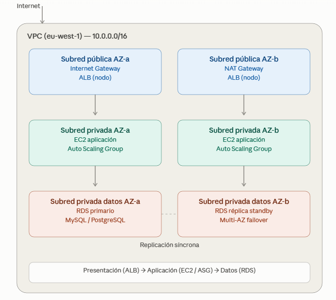
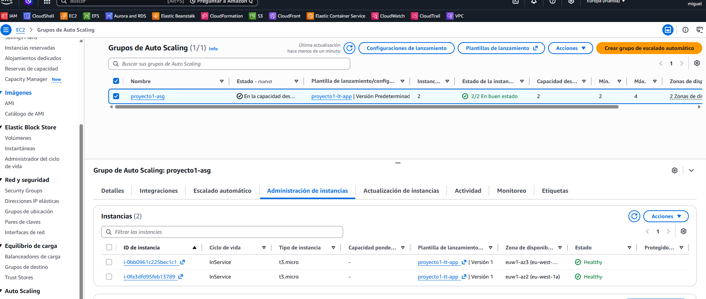
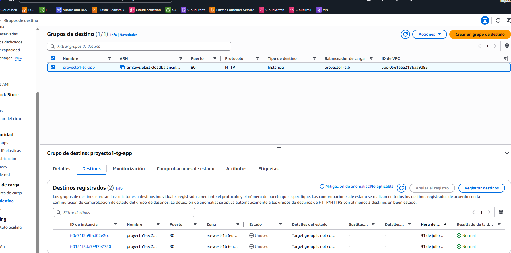
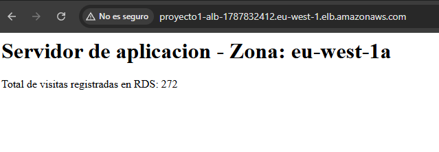
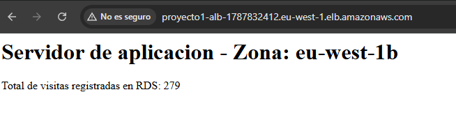
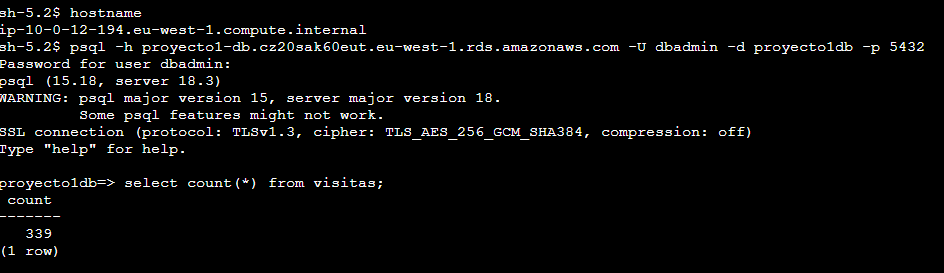
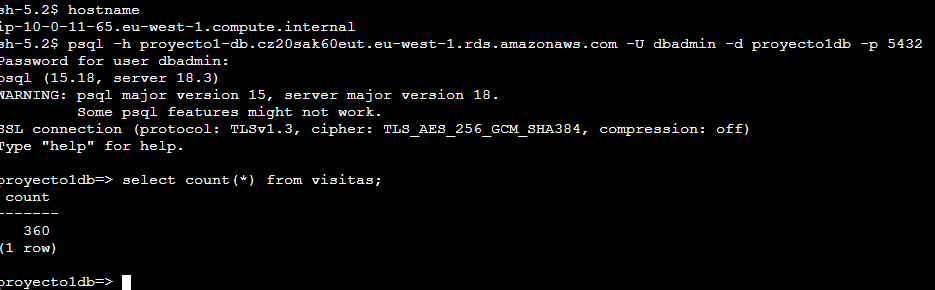

# Arquitectura Web de 3 Capas en AWS

+ Arquitectura web clásica de 3 capas desplegada en AWS a mano, desde la consola y CLI, antes de automatizarla con Terraform en el siguiente proyecto de este portfolio.

+ La idea era simple: montar algo con separación real de capas, alta disponibilidad en dos zonas, y que fuera capaz de recuperarse solo si una instancia cae. Nada de una EC2 suelta con todo mezclado.
  

## Cómo está montado

+ Internet entra por un Application Load Balancer repartido en dos zonas de disponibilidad. Detrás, un Auto Scaling Group mantiene siempre 2 instancias EC2 sanas en subredes privadas — si una falla, se reemplaza sola. La base de datos (RDS PostgreSQL) vive en otra subred privada aparte, sin acceso público bajo ningún concepto.

+ Nada de la capa de aplicación ni de datos tiene IP pública. Solo el Load Balancer es accesible desde fuera.

## Por qué lo monté así

- **Subredes privadas para todo salvo el ALB**: si algo no necesita recibir tráfico directo de internet, no debería poder recibirlo. Punto.
- **Security Groups que se referencian entre sí, no por IP**: cada capa solo confía en el Security Group de la capa anterior. Si el ALB cambiara de IP mañana, no rompería nada — la regla sigue siendo válida porque apunta al grupo, no a una dirección fija.
- **Session Manager en vez de SSH**: sin claves que gestionar, sin puerto 22 abierto a nadie. Todo pasa por IAM.
- **Auto Scaling Group conectado al Load Balancer**: probé esto matando una instancia a mano para ver si realmente se reemplazaba sola. Funcionó.

## Infraestructura desplegada y funcionando

+ El Auto Scaling Group manteniendo sus 2 instancias sanas:
  

+ Y el Target Group confirmando que ambas pasan los health checks del Load Balancer:
  

## Prueba de que funciona de verdad, no solo en el diagrama

+ No me quedé solo en la conexión de red — instalé PHP en las instancias y monté una tabla en RDS que cuenta visitas. Cada vez que el ALB reparte una petición a cualquiera de las dos instancias, esa instancia escribe en la misma base de datos compartida.

+ Refrescando la web servida por el ALB, se ve alternar entre las dos zonas de disponibilidad:
  
  

+ Y por debajo, la conexión a la base de datos verificada directamente desde terminal:
  
  

## Lo que no salió a la primera (y cómo lo arreglé)

- **Session Manager no conectaba.** Resultó ser una combinación de dos cosas: la VPC tenía deshabilitado "DNS hostnames" (algo que no viene activado por defecto al crear una VPC manualmente), y el rol IAM se lo asigné a la instancia después de lanzarla, no en el momento de creación. Con ambas cosas corregidas y un reinicio, el agente SSM se registró sin problema.

- **Los metadatos de la instancia venían vacíos.** Amazon Linux 2023 usa IMDSv2 por defecto, que exige pedir un token antes de consultar los metadatos — a diferencia de IMDSv1, donde un simple `curl` bastaba. Un detalle fácil de pasar por alto si vienes de tutoriales antiguos.

- **RDS se negaba a cambiar de subnet group** con un error bastante confuso (`InvalidVPCNetworkStateFault`, diciendo literalmente lo contrario de lo que pasaba). Después de confirmar que no era un problema de configuración por mi parte, terminé borrando la instancia (estaba vacía, sin coste de perder nada) y recreándola por CLI especificando el subnet group correcto desde el origen — más rápido que seguir peleando con un bug conocido de la consola.

- **La conexión a la base de datos se quedaba colgada sin dar error.** Terminé siendo el puerto: había configurado el Security Group de RDS con la regla de MySQL (3306) por error, en vez de PostgreSQL (5432). Un `psql` colgado sin mensaje de error es casi siempre un problema de Security Group, no de credenciales — si fuera de credenciales, falla rápido y dice claramente que la contraseña está mal.

## Cuánto cuesta esto al mes

+ Sobre unos 80-85 USD/mes con esta configuración en `eu-west-1`. El dato que más me sorprendió: el NAT Gateway solo, sin apenas tráfico real, ya supone cerca del 40% del coste total. Si esto fuera a producción con tráfico real hacia otros servicios de AWS, lo primero que miraría sería meter VPC Endpoints para quitarle carga al NAT.

## Lo que dejé fuera a propósito

- **HTTPS**: necesitaría un dominio propio para pedir un certificado en ACM (AWS no emite certificados para sus dominios `.amazonaws.com`). No quería meter un coste recurrente de dominio solo para un proyecto de portfolio, pero el proceso sería: comprar dominio → Route 53 → ACM → añadir listener 443 al ALB.
- **CloudWatch**: sin alarmas ni dashboards por ahora. Sería lo primero que añadiría si esto tuviera tráfico real.
- **Todo esto hecho a mano**: es el punto de partida. El siguiente proyecto de este portfolio es la misma arquitectura pero en Terraform.

## Stack

+ AWS VPC · EC2 · Auto Scaling · Application Load Balancer · RDS PostgreSQL · IAM · Systems Manager Session Manager

## Estado

+ Completado. Los recursos se desmantelaron tras documentar el proyecto para no generar coste continuo — las capturas y este README son la evidencia de que funcionó.

## Autor

+ Miguel — [GitHub](https://github.com/mamoros-dev) · [LinkedIn](https://www.linkedin.com/in/miguel-amoros-moret/)